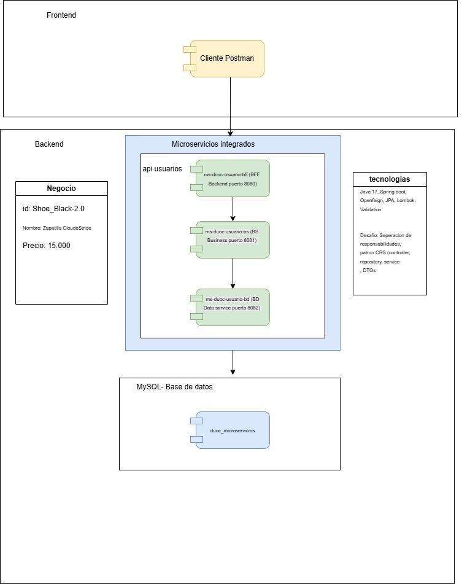

# Ecosistema de Microservicios: Calzado e Innovación Textil 👟✨

Este proyecto consiste en un sistema de gestión y distribución para el rubro de **Calzado e Innovación Textil**, tomando como base el diseño y logística del producto estrella **Zapatillas de Descanso CloudStride**.

La solución implementa una arquitectura limpia y desacoplada dividida en tres capas independientes: **BFF** (Backend For Frontend), **BS** (Business Service) y **DB/BD** (Data Service).

---

## 📐 Diagrama de Arquitectura del Sistema

A continuación se presenta el flujo de comunicación y puertos del ecosistema de microservicios basado en el diseño del módulo de usuarios:



---

## ⚙️ Matriz de Servicios y Puertos (Repositorios Activos)

A continuación se detalla la distribución de tus tres repositorios activos en GitHub que componen el módulo de **Clientes y Usuarios** con sus respectivos puertos de escucha:

| Módulo | Microservicio | Tipo/Capa | Puerto | Repositorio GitHub |
| :--- | :--- | :--- | :--- | :--- |
| **Clientes y Usuarios** <br>*(Perfiles, preferencias de calzado y direcciones)* | `ms-duoc-usuario-bff` | BFF (Orquestador) | **8080** | [Ver Repositorio 🔗](https://github.com/felipegonzalez1983/ms-duoc-usuario-bff) |
| | `ms-duoc-usuario-bs` | BS (Negocio) | **8081** | [Ver Repositorio 🔗](https://github.com/felipegonzalez1983/ms-duoc-usuario-bs) |
| | `ms-duoc-usuario-bd` | DB (Datos) | **8082** | [Ver Repositorio 🔗](https://github.com/felipegonzalez1983/ms-duoc-usuario-bd) |
| | `ms-duoc-productos-bs` | BS (Negocio) | **8181** | [Ver Repositorio 🔗](https://github.com/felipegonzalez1983/ms-producto-bs.git) |
| | `ms-duoc-productos-bd` | DB (Datos) | **8182** | [Ver Repositorio 🔗](https://github.com/felipegonzalez1983/ms-producto-db.git) |
`ms-duoc-productos-bff` | BFF (Orquestador) | **8180** | [Ver Repositorio 🔗]([(https://github.com/felipegonzalez1983/ms-producto-bff.git))] |
---

## 🛠️ Stack Tecnológico Unificado

* **Lenguaje:** Java 17
* **Framework Principal:** Spring Boot 4.0.6
* **Comunicación Inter-servicio:** Spring Cloud OpenFeign *(Implementado exclusivamente en capas bff y bs)*
* **Persistencia:** Spring Data JPA
* **Base de Datos:** MySQL *(Mapeado mediante mysql-connector-j)*
* **Productividad:** Project Lombok & Spring Validation Starter

---

## 🎯 Responsabilidad de las Capas

### 1. Capa BFF (Backend For Frontend) - Puerto 8080
* Punto de entrada exclusivo para aplicaciones cliente o pruebas en herramientas como **Postman**.
* Realiza validaciones primarias de los contratos de entrada y orquesta las llamadas hacia la capa lógica (`bs`).
* Utiliza clientes declarativos con **OpenFeign** para comunicarse internamente.

### 2. Capa BS (Business Service) - Puerto 8081
* Contiene las reglas del negocio principal (procesamiento de tallas, control de stock de plástico reciclado, validaciones de montos en pesos, etc.).
* Transforma datos usando Mappers/DTOs y expone endpoints de consulta interna a la capa BFF.

### 3. Capa DB/BD (Data Service) - Puerto 8082
* Única capa del ecosistema con privilegios y conexión directa a la base de datos **MySQL** (`db_usuarios`).
* Asegura el aislamiento absoluto de la persistencia para cumplir con el patrón *Database per Service*.

---

## 🗄️ Estructura del Modelo de Datos (Ejemplo: Productos)

Para mapear de manera correcta nuestro producto estrella, la estructura JSON utilizada en las capas es la siguiente:
```json
{
  "id": "String (Ej: SHOE-CLD-88)",
  "nombre": "String (Ej: Zapatillas de Descanso CloudStride)",
  "descripcion": "String (Ej: Calzado ultra liviano con suela de espuma viscoelástica...)",
  "precio": "Double / BigDecimal (Ej: 15000 pesos)"
}
```

---

## 🚀 Secuencia de Levantamiento Local

Inicia los servicios en orden ascendente para garantizar que las dependencias de red estén listas y disponibles:

1. **Base de Datos:** Inicializar MySQL local con el esquema `db_usuarios`.
2. **Capa DB/BD:** Iniciar el proyecto `ms-duoc-usuario-bd` *(Puerto 8082)*.
3. **Capa BS:** Iniciar el proyecto `ms-duoc-usuario-bs` *(Puerto 8081)*.
4. **Capa BFF:** Finalmente, iniciar `ms-duoc-usuario-bff` *(Puerto 8080)* para recibir peticiones externas.
